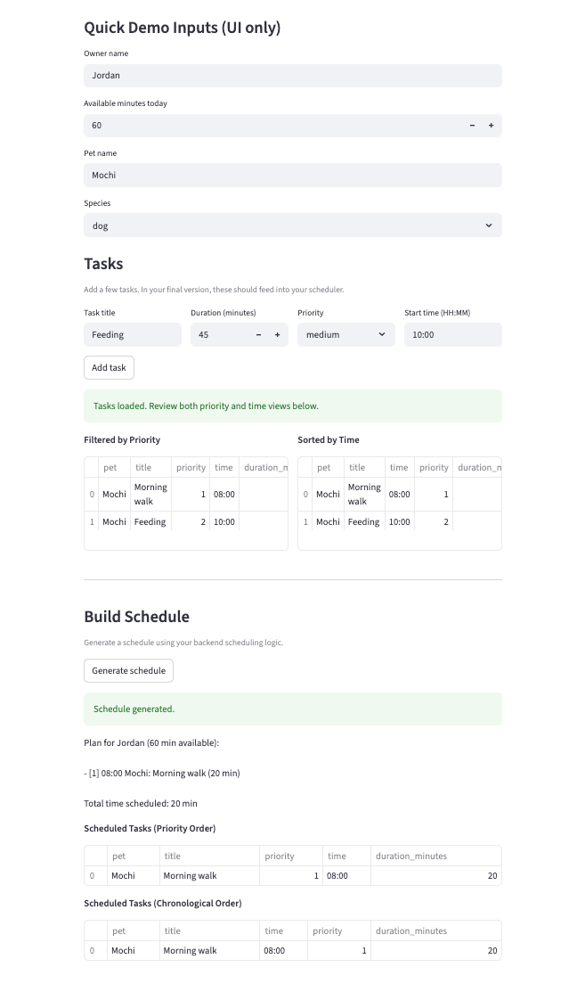

# PawPal+ (Module 2 Project)

You are building **PawPal+**, a Streamlit app that helps a pet owner plan care tasks for their pet.

## Scenario

A busy pet owner needs help staying consistent with pet care. They want an assistant that can:

- Track pet care tasks (walks, feeding, meds, enrichment, grooming, etc.)
- Consider constraints (time available, priority, owner preferences)
- Produce a daily plan and explain why it chose that plan

Your job is to design the system first (UML), then implement the logic in Python, then connect it to the Streamlit UI.

## What you will build

Your final app should:

- Let a user enter basic owner + pet info
- Let a user add/edit tasks (duration + priority at minimum)
- Generate a daily schedule/plan based on constraints and priorities
- Display the plan clearly (and ideally explain the reasoning)
- Include tests for the most important scheduling behaviors

## Getting started

### Setup

```bash
python -m venv .venv
source .venv/bin/activate  # Windows: .venv\Scripts\activate
pip install -r requirements.txt
```

### Suggested workflow

1. Read the scenario carefully and identify requirements and edge cases.
2. Draft a UML diagram (classes, attributes, methods, relationships).
3. Convert UML into Python class stubs (no logic yet).
4. Implement scheduling logic in small increments.
5. Add tests to verify key behaviors.
6. Connect your logic to the Streamlit UI in `app.py`.
7. Refine UML so it matches what you actually built.

### Smarter Scheduling
This app now has smarter task scheduling features so you can complete more tasks more efficiently, and set up daily and weekly schedules. The scheduling feature basically gathers all pet-care tasks, prioritizes them, and builds a daily plan that fits within the user's available minutes while also supporting sorting by task duration. It also handles recurring tasks by creating the next daily or weekly instance after completion and can report overlapping task-time conflicts as warnings. 

### Testing PawPal
Use the command python -m pytest to run the test cases. My tests cover: 
Exact time-budget boundary inclusion
Just-over-budget rejection by 1 minute
Priority-time mismatch behavior
Stable ordering on tie priority
HH:MM parsing edge cases (00:00, 23:59, single-digit, 24:00, 9:75)
Sorting correctness (chronological order)
Recurrence logic for daily completion
Conflict detection for duplicate times

I am 5 star confident in the system reliability because it passed all of the test cases. 


### Features: 
Priority-Based Scheduling
Builds a daily plan by sorting all pet tasks by priority and selecting tasks that fit within the owner’s available time budget.

Time-Aware Task Sorting
Sorts tasks in chronological order using HH:MM parsing with numeric hour/minute comparison.

Conflict Detection Across Tasks
Detects overlapping start times and identifies all conflicting task pairs, including conflicts within one pet’s tasks and across different pets.

Non-Fatal Conflict Warnings
Converts detected conflicts into warning messages so scheduling can continue without crashing.

Recurring Task Automation
When a daily or weekly task is marked complete, automatically creates the next occurrence with the due date shifted by +1 day or +7 days.

Time-Budget Constraint Enforcement
Prevents over-scheduling by skipping tasks that would exceed the owner’s available minutes.

Human-Readable Plan Explanation
Generates a clear textual summary of scheduled tasks, including priority, time, pet, task name, and total scheduled minutes.


### Demo: 
### Demo:
<a href="final_app.png" target="_blank">
  
</a>